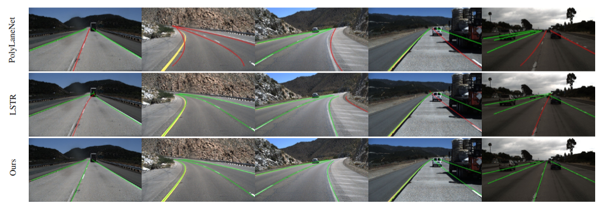

**FuseRoad**: Enhancing Lane Shape Prediction Through Semantic Knowledge Integration and Cross-Dataset Training
=======

<div align="center">
  
</div>
<p align="center">
  Figure 1: Architecture of FuseRoad.
</p>

* 🔥 End-to-end multi task training: Use two dataset simultaneously.
* 🔥 High performance: reach remarkable 97.42% F-1 score on the TuSimple testing set.

## Set Envirionment

* Linux ubuntu 20.04 with python 3.11, pytorch 2.1.2, cudatoolkit 12.2

Create a new conda environment and install the required packages:
```
conda env create --name FuseRoad python=3.11
```

```
conda activate FuseRoad
```

After creating the environment, install the required packages:

```
pip imstall openmim
mim install mmcv-full
pip install -r requirements.txt
cd models/py_utils/orn && pip install .
```

CULane evaluation environment is required to evaluate the performance on CULane dataset. Please refer to [CULane](https://xingangpan.github.io/projects/CULane.html) to compile the evaluating environment.

## Data Preparation

Download and extract TuSimple train, val and test with annotations from 
[TuSimple](https://github.com/TuSimple/tusimple-benchmark)
, and download and extract CULane train, val and test with annotations from
[CULane](https://xingangpan.github.io/projects/CULane.html).

We expect the directory structure to be the following:
### TuSimple:
```
TuSimple/
    LaneDetection/
        clips/
        label_data_0313.json
        label_data_0531.json
        label_data_0601.json
        test_label.json
```

### CULane:
```
CULane/
    driver_23_30frame/
    driver_37_30frame/
    driver_100_30frame/
    driver_161_90frame/
    driver_182_30frame/
    driver_193_90frame/
    list/
        test_split/
        test.txt
        train.txt
        train_gt.txt
        val.txt
        val_gt.txt
```

### Cityscapes:
```
Cityscapes/
    train/              # imgs_in train set
    train_labels/       # labels_in train set
    val/                # imgs_in val set
    val_labels/         # labels_in val set
    Cityscapes_class_dict_19_classes.csv
```

## Training
Download the pretrained weights from [Segformer](https://github.com/NVlabs/SegFormer) provided [OneDrive](https://connecthkuhk-my.sharepoint.com/personal/xieenze_connect_hku_hk/_layouts/15/onedrive.aspx?id=%2Fpersonal%2Fxieenze%5Fconnect%5Fhku%5Fhk%2FDocuments%2Fsegformer%2Fpretrained%5Fmodels&ga=1) and put it to models/py_utils/SegFormer/imagenet_pretrained directory.
To train a model:

(If you only want to use the train set, please see config file and set "train_split": "train")

(If you don't want to use the SRKE module, please set "use_SRKE": False)
```
python train.py CONFIG_FILE_NAME --model_name FuseRoad
```
* Visualized images are in ./results during training.
* Saved model files are in ./cache during training.

To train a model from a snapshot model file:
```
python train.py CONFIG_FILE_NAME --model_name FuseRoad --iter ITER_NUMS
```

## Evaluation
Download the trained model from [GoogleDrive](https://drive.google.com/drive/folders/1e35oSeIUSWnr4MvrlIP853U91qCwbnLp?usp=drive_link) and put it to ./cache directory.

### Example
```
python test.py CONFIG_FILE_NAME --model_name FuseRoad --modality eval --split testing --testiter ITER_NUMS
```

### Eval on TuSimple
```
python test.py FuseRoad_TuSimple --model_name FuseRoad --modality eval --split testing --testiter 800000
```
### Eval on CULane
```
python test.py FuseRoad_CULane_b5 --model_name FuseRoad --modality eval --split testing --testiter 800000
```
then
```
cd lane_evaluation
sh run.sh   # to obtain the overall F1-measure
sh Run.sh   # to valid the splitting performance
```


### To save detected images
```
python test.py FuseRoad_TuSimple --model_name FuseRoad --modality eval --split testing --testiter 800000 --debug
```

## Demo

### To demo on a set of images(store images in root_dir/images, then the detected results will be saved in root_dir/detections):
```
python test.py FuseRoad_TuSimple --model_name FuseRoad --modality images --image_root root_dir --debug
```

### Or can use the following command to demo on images in a specific directory and determine the output directory(recommended):
```
python3 demo.py FuseRoad_TuSimple --model_name FuseRoad --testiter 800000 --image_root image_dir --save_root save_dir
```

## Results

<div align="center">
  
</div>
<p align="center">
  Table 1: Comparison with State-of-the-art methods on TuSimple testing set.
</p>

<div align="center">
  
</div>
<p align="center">
  Figure 2: Qualitative results on TuSimple testing set.
</p>


## License
FuseRoad is released under BSD 3-Clause License.

## Acknowledgements

[DETR](https://github.com/facebookresearch/detr)

[PolyLaneNet](https://github.com/lucastabelini/PolyLaneNet)

[CornerNet](https://github.com/princeton-vl/CornerNet)

[CULane](https://xingangpan.github.io/projects/CULane.html)

[LSTR](https://github.com/liuruijin17/LSTR)
